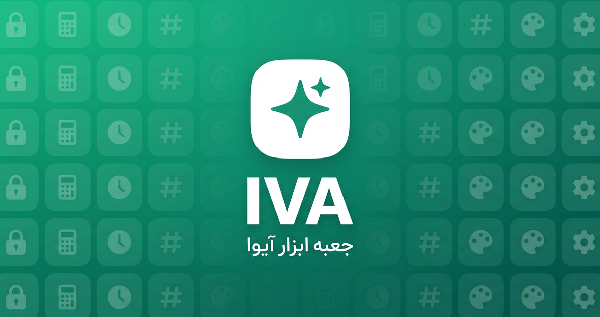

<p align="center">
  
</p>

# IR-Toolbox — جعبه ابزار آفلاین فارسی | Offline-First Web Toolbox (PWA)

<p align="center">
  <a href="https://github.com/Kourosh242/IR-Toolbox/blob/main/LICENSE"></a>
  
  
  
  
  <a href="https://kourosh242.github.io/IR-Toolbox/"></a>
</p>

<p align="center">
  <strong>جعبه ابزار IR</strong> — یک وب‌اپ کاملاً محلی و آفلاین با ۵۲ ابزار کاربردی در ۹ دسته.
</p>

<p align="center">
  <a href="https://kourosh242.github.io/IR-Toolbox/"><strong>🌐 وبسایت رسمی </strong></a>
  ·
  <a href="https://github.com/Kourosh242/IR-Toolbox/wiki">📚 ویکی پروژه</a>
  ·
  <a href="https://github.com/Kourosh242/IR-Toolbox/issues/new/choose">🐞 گزارش باگ یا پیشنهاد</a>
  ·
  <a href="LICENSE">📄 لایسنس MIT</a>
</p>

<p align="center">
  <a href="https://kourosh242.github.io/IR-Toolbox/about/"><strong>ℹ️ درباره، حریم خصوصی و امنیت</strong></a>
  ·
  <a href="https://kourosh242.github.io/IR-Toolbox/tools/"><strong>🧰 فهرست ۵۲ ابزار</strong></a>
  ·
  <a href="https://kourosh242.github.io/IR-Toolbox/llms.txt">🤖 llms.txt</a>
  ·
  <a href="CITATION.cff">🎓 استناد (CITATION.cff)</a>
</p>

> **⚠️ ابهام‌زدایی از نام:** این **IR-Toolbox** یک جعبه‌ابزار فارسی و آفلاین برای کارهای روزمرهٔ مرورگر است.
> با کتابخانه‌ها یا پروژه‌های پژوهشی «بازیابی اطلاعات» (Information Retrieval) و بسته‌های MATLAB
> که نام مشابه دارند **هیچ ارتباطی ندارد**.
>
> *Disambiguation:* this **IR-Toolbox** is a Persian offline-first browser toolbox.
> It is **not** an Information Retrieval library or MATLAB package that shares a similar name.

---

**IR-Toolbox** (جعبه ابزار IR) is a **free, open-source, offline-first Progressive Web App (PWA)** with **52 privacy-first web tools in 9 categories** — text tools, developer utilities, design tools, file tools, calculators, time tools (Jalali/Shamsi calendar), security tools (AES-256-GCM encrypted vault, password manager, hash checker), QR code generator & scanner, and offline games. Everything runs **100% locally in your browser: no server, no database, no upload, no tracking** — built for Persian (Farsi) users with full RTL support, and it works anywhere.

**جعبه ابزار IR** یک وب‌اپلیکیشن **رایگان، متن‌باز و کاملاً آفلاین** است: ۵۲ ابزار کاربردی فارسی در ۹ دسته — از ابزارهای متن و توسعه‌دهنده تا رمزنگاری AES-256، مدیر رمز عبور، QR‌خوان و تقویم شمسی. همه‌ی پردازش‌ها **روی دستگاه شما** انجام می‌شود؛ هیچ داده‌ای به سرور ارسال نمی‌شود و بدون اینترنت هم کامل کار می‌کند.

## 📌 معرفی و استناد (About & Citation)

متن استاندارد زیر برای استناد، معرفی در مقاله/وبلاگ یا ارجاع به پروژه آماده است
(بدون هیچ ادعای افزوده — همان واقعیت‌هایی که در کد وجود دارد):

> **IR-Toolbox** is a free and open-source (MIT) Persian offline-first Progressive Web App
> created by **Kourosh242**. It provides **52 browser-based tools across 9 categories**,
> with a strong focus on privacy, local processing, and offline use.
>
> **IR-Toolbox** یک وب‌اپلیکیشن رایگان و متن‌باز (MIT)، آفلاین و فارسی است که توسط **Kourosh242**
> ساخته شده و **۵۲ ابزار مرورگری در ۹ دسته** ارائه می‌دهد؛ با تأکید بر حریم خصوصی،
> پردازش محلی و استفادهٔ بدون اینترنت.

| منبع | آدرس |
| --- | --- |
| وب‌اپلیکیشن | <https://kourosh242.github.io/IR-Toolbox/> |
| صفحهٔ درباره (هویت، حریم خصوصی، امنیت، محدودیت‌ها) | <https://kourosh242.github.io/IR-Toolbox/about/> |
| فهرست ابزارها | <https://kourosh242.github.io/IR-Toolbox/tools/> |
| مخزن کد | <https://github.com/Kourosh242/IR-Toolbox> |
| خلاصهٔ ماشین‌خوان برای دستیارهای هوش مصنوعی | <https://kourosh242.github.io/IR-Toolbox/llms.txt> |
| فایل استناد | [`CITATION.cff`](CITATION.cff) |

- **نسخه:** 1.3.6 · **لایسنس:** MIT · **سازنده:** [Kourosh242](https://github.com/Kourosh242)
- **فناوری:** Vanilla JavaScript (ES modules) — بدون فریم‌ورک و بدون مرحلهٔ build
- **حریم خصوصی:** بدون سرور، بدون API، بدون کوکی ردیابی و بدون اسکریپت شخص ثالث

## 🚀 شروع سریع (Quick Start)

### 🌐 استفاده آنلاین — بدون نصب

فقط کافیست آدرس زیر را باز کنید؛ همیشه آخرین نسخه را دارید:

**➡️ https://kourosh242.github.io/IR-Toolbox/**

### 📲 نصب به‌عنوان اپلیکیشن (PWA)

- **اندروید / کروم:** آیکون «نصب» (Install) در نوار آدرس را بزنید یا منوی ⋮ ← «Add to Home screen».
- **ویندوز / مک / لینوکس (کروم، اج):** آیکون نصب در نوار آدرس، یا منوی ⋮ ← «Install IR-Toolbox…».
- **iOS / سافاری:** دکمه Share ⬆️ ← «Add to Home Screen».
- پس از نصب، اپ **کاملاً آفلاین** اجرا می‌شود و به‌روزرسانی‌ها خودکار اعمال می‌شوند.

### 💻 اجرای محلی از سورس (Local Development)

پیش‌نیاز: فقط [Git](https://git-scm.com/) و یک مرورگر مدرن. (برای سرویس‌ورکر، فایل باید از طریق HTTP سرو شود؛ `file://` فقط بخشی از ابزارها را اجرا می‌کند.)

```bash
git clone https://github.com/Kourosh242/IR-Toolbox.git
cd IR-Toolbox
python3 -m http.server 8080
```

سپس `http://localhost:8080` را در مرورگر باز کنید. (یا از هر سرور استاتیک دیگری مثل `npx serve` استفاده کنید.)

> به فایل‌های `.ir256` (خروجی گاوصندوق IR) نیاز دارید؟ همان فایل‌ها با هر نسخه‌ای از اپ باز می‌شوند — رمزنگاری AES-256-GCM استاندارد است و هیچ سروری در کار نیست.

---

## ✨ قابلیت‌ها

- 🔒 **کاملاً محلی و آفلاین** — بدون سرور، بدون دیتابیس، بدون آپلود؛ داده‌های شما از دستگاه شما بیرون نمی‌رود.
- 🧰 **۵۲ ابزار در ۹ دسته** — متن، توسعه‌دهنده، طراحی، فایل، محاسبات، زمان، امنیت، سرگرمی و بازی فکری.
- 🛡️ **گاوصندوق IR** — رمزنگاری متن/فایل با AES-256-GCM و مشتق کلید PBKDF2، با خروجی `.ir256`؛ از v1.3.6 با فشرده‌سازی gzip قبل از رمزنگاری و نمایش درصد کاهش حجم.
- 📷 **QR‌خوان + بررسی ایمنی لینک** — اسکن زنده با دوربین یا آپلود تصویر، همراه موتور هیوریستیک کاملاً آفلاین برای شناسایی لینک‌های فیشینگ (v1.3.6).
- 📲 **PWA واقعی** — قابل نصب و استفاده‌ی کاملاً آفلاین.
- 🇮🇷 **فارسی و راست‌چین** — با فونت خودمیزبان وزیرمتن (بدون CDN، مناسب ایران).
- 🧩 **رجیستری ماژولار** — افزودن ابزار جدید بدون دست‌کاری هسته اپ.
- 🎨 **پوسته‌های متنوع** — روشن، تاریک، سیستم، نیمه‌شب و شیشه‌ای.
- 🌌 **طراحی نو (Design System v2)** — پس‌زمینه‌ی aurora، سطوح شیشه‌ای، هاله‌ی نور دنبال‌کننده‌ی نشانگر و کاشی آیکون رنگی برای هر دسته.
- ⌨️ **پالت فرمان** — جستجوی سریع ابزار با `Ctrl+K` / `Cmd+K`.

## 🧰 ۵۲ ابزار در ۹ دسته

| دسته | Category | نمونه ابزارها |
|------|----------|----------------|
| 📝 متن | Text | جست‌وجو/جایگزینی، شمارنده، اسلاگ‌ساز، پاک‌سازی متن، جداکننده ۳ رقمی |
| 💻 توسعه‌دهنده | Developer | فرمت‌کننده JSON، Base64، CSV ↔ JSON، تبدیل Timestamp، مترجم Cron، px ↔ rem |
| 🎨 طراحی | Design | رنگ‌ساز و مبدل رنگ، بررسی کنتراست، لورم فارسی، تایپوگرافی |
| 📁 فایل | Files | بررسی هش فایل، تبدیل Base64 ← فایل، Data URL، تغییر اندازه تصویر |
| 🧮 محاسبات | Math | ماشین‌حساب علمی، درصد، تبدیل واحد، BMI، ریاضی سرعتی |
| ⏰ زمان | Time | تقویم شمسی/جلالی، محاسبه سن، پومودورو، کرنومتر و تایمر |
| 🔐 امنیت | Security | گاوصندوق IR (AES-256-GCM)، مدیر رمز عبور، رمزساز، QR‌خوان با بررسی ایمنی لینک |
| 🎉 سرگرمی | Fun | جوک، ایده‌ساز، دورهمی، چالش‌های آفلاین |
| 🧠 بازی فکری | Brain | بازی‌های حافظه و سرعت با رکورد محلی |

همراه با ابزارهای محبوب: **QR‌کدساز آفلاین**، **مدیر رمز عبور رمزنگاری‌شده**، **پیکر تقویم شمسی**، **مترجم Cron فارسی** و **گاوصندوق IR** با فشرده‌سازی و رمزنگاری استاندارد.

## 📸 اسکرین‌شات‌ها (Screenshots)

<p align="center">
  
</p>

*(اسکرین‌شات‌های بیشتر از هر ابزار در [ویکی پروژه](https://github.com/Kourosh242/IR-Toolbox/wiki) قرار می‌گیرند.)*

## ❓ سوالات متداول (FAQ)

**۱. آیا IR-Toolbox رایگان و متن‌باز است؟**
بله. IR-Toolbox تحت لایسنس **MIT** کاملاً رایگان و متن‌باز است؛ می‌توانید از آن استفاده، تغییر و منتشر کنید.

**۲. داده‌های من کجا ذخیره می‌شود؟ آیا به سروری ارسال می‌شود؟**
خیر — هیچ‌وقت. همه‌ی پردازش‌ها و ذخیره‌سازی (تنظیمات، مدیر رمز، تاریخچه) **روی دستگاه شما** انجام می‌شود. اپ هیچ سرور، دیتابیس، آنالیتیکس یا ردیابی ندارد.

**۳. آیا بدون اینترنت هم کار می‌کند؟**
بله. IR-Toolbox یک **PWA واقعی** است؛ یک‌بار باز کنید یا نصبش کنید، بعد از آن حتی با قطع اینترنت کامل اجرا می‌شود (Service Worker همه‌ی فایل‌ها را کش می‌کند).

**۴. چطور IR-Toolbox را روی گوشی یا کامپیوتر نصب کنم؟**
آدرس [kourosh242.github.io/IR-Toolbox](https://kourosh242.github.io/IR-Toolbox/) را در کروم/اج/سافاری باز کنید و از نوار آدرس «نصب» را بزنید (iOS: دکمه Share ← Add to Home Screen). راهنمای کامل در بخش «شروع سریع» همین صفحه است.

**۵. فرمت `.ir256` گاوصندوق IR چگونه کار می‌کند؟**
متن یا فایل شما ابتدا فشرده (gzip) و سپس با **AES-256-GCM** رمزنگاری می‌شود؛ کلید با **PBKDF2** از رمز اصلی شما مشتق می‌شود و هیچ‌جا ذخیره نمی‌شود. فایل خروجی فقط با همان رمز باز می‌شود.

**۶. آیا می‌توانم ابزار جدید اضافه کنم؟**
بله — معماری **رجیستری ماژولار** دارد و افزودن ابزار جدید بدون دست‌کاری هسته اپ ممکن است. بخش «مشارکت» را ببینید؛ PR‌های شما خوش‌آمد است. 🙌

## 🤝 مشارکت و پشتیبانی

مشارکت‌ها خوش‌آمد است! 🎉

- 🐞 **گزارش باگ یا پیشنهاد ویژگی:** [ایجاد Issue](https://github.com/Kourosh242/IR-Toolbox/issues/new/choose)
- 🔧 **ارسال تغییرات:** [CONTRIBUTING.md](CONTRIBUTING.md) را بخوانید و Pull Request بفرستید.
- 💬 **سوال و گفتگو:** [Discussions](https://github.com/Kourosh242/IR-Toolbox/discussions)
- 🔒 **گزارش مشکل امنیتی:** لطفاً علنی گزارش نکنید — [SECURITY.md](SECURITY.md) را ببینید.
- ⭐ اگر این پروژه برایتان مفید بود، دادن **Star** بهترین حمایت است!

## 📄 لایسنس

این پروژه تحت لایسنس [MIT](LICENSE) منتشر شده است — رایگان برای استفاده شخصی و تجاری.

## 🗂️ تغییرات نسخه

### v1.3.6
- 📷 **ابزار جدید: QR‌خوان** — خواندن QR از آپلود تصویر (گالری) و اسکن زنده با دوربین + تشخیص نوع خروجی (لینک/متن/تماس/ایمیل/WiFi/کارت ویزیت) با `jsQR` vendored.
- 🔍 **بررسی ایمنی هوشمند لینک** — موتور هیوریستیک کاملاً آفلاین (punycode/همگلیف، IP خام، ترفند `@`، کوتاه‌کننده‌ها، TLD پرریسک، جعل برند) با حکم سه‌سطحی ایمن/مشکوک/خطرناک و تأیید پیش از بازکردن لینک.
- 🕘 تاریخچهٔ محلی اسکن‌ها در QR‌خوان — ۱۰ اسکن آخر، فقط روی دستگاه و قابل پاک‌کردن.
- 🧾 **ابزار جدید: «جداکنندهٔ ۳ رقمی»** در تب محاسبات — `150000` → `150,000` + نسخهٔ فارسی (۱۵۰٬۰۰۰) و تشخیص ورودیِ از‌قبل‌جداشده.
- 🗜️ **فشرده‌سازی خروجی گاوصندوق IR** — ترتیب درستِ فشرده‌سازی→رمزنگاری (gzip بومی مرورگر)، سازگار با فایل‌های قدیمی `.ir256`/`.iva256` + نمایش حجم ورودی/فشرده/نهایی و درصد کاهش.
- 🧹 پاک‌سازی متن: عملیات حالا زنجیره‌ای‌اند و در همهٔ حالت‌ها فاصلهٔ اضافه/خط خالی حذف می‌شود؛ «حذف تکراری» با trim کار می‌کند + شمارندهٔ خطوط.
- ⚡ **سرعت بارگذاری** — `vendor/jsQR.js` (۲۵۱KB) دیگر با تگ بلاک‌کننده در `index.html` بارگذاری نمی‌شود و فقط هنگام بازکردن QR‌خوان با import پویا گرفته می‌شود؛ ماژول‌های دسته‌های ابزار هم تنبل (lazy) بارگذاری می‌شوند — گراف بار اول از ۳۴ فایل/۲۸۳KB به ۱۱ فایل/۶۵KB رسید — و فونت وزیرمتن پیش از شیوه‌نامه‌ها `preload` می‌شود.
- 🔗 رفع بررسی ایمنی لینک: ترفند `@` با userinfo خالی (مثل `https://@evil.com/`) هم پرچم خطر می‌گیرد (شرط مردهٔ `url.host.includes("@")` حذف شد).
- 📲 Service Worker: کش `ir-v10` با به‌روزرسانی خودکار.

### v1.3.5
- 🎨 **ظاهر کاملاً نو (Design System v2)** — پس‌زمینه‌ی aurora با گوی‌های نور متحرک، شبکه و بافت ظریف؛ سطوح شیشه‌ای (blur) در سایدبار، نوار بالا، ناوبری پایین، کارت‌ها و توست‌ها.
- ✨ کارت‌های ابزار/دسته با هاله‌ی نور دنبال‌کننده‌ی نشانگر (Spotlight) و انیمیشن ورود پلکانی؛ کاشی آیکون رنگی برای هر دسته و دکمه‌های گرادیانی با جاروی نور.
- 🏷️ نشان نسخه کنار لوگوی سایدبار + کارت «۱۰۰٪ آفلاین»؛ عنوان خانه با گرادیان رنگی متحرک و ناوبری پایین موبایل با پیل فعال.
- 🎛️ توکن‌های رنگی نو برای هر ۴ پوسته (روشن/تاریک/مشکیِ نیمه‌شب/شیشه‌ای) با کنتراست WCAG.
- 🧮 ماشین‌حساب: نماد علمی با مانتیس چندرقمی (مثل `12e3`) درست حساب می‌شود و خطای نحوی JS با پیام «عبارت نامعتبر» نمایش داده می‌شود.
- ⏰ مترجم Cron: نام‌های استاندارد انگلیسی (MON, JAN) شناخته می‌شوند؛ بازه‌ی معکوس و عبارت ناقص خطای واضح می‌گیرند.
- 🔤 Base64: فاصله/خط‌شکستگی و padding ناقص (مثل JWT) دیگر خطا نمی‌دهند.
- 🧾 JSON: دکمه‌ی کپی بعد از «معتبر است» خروجی کهنه‌ی قبلی را کپی نمی‌کند.
- 🔗 اسلاگ: حروف عربی (ي ك ة ؤ إ)، ارقام فارسی/عربی و اعراب هم پوشش داده می‌شوند.
- 🖼️ Data URL: object URLهای پیش‌نمایش قبلی آزاد می‌شوند و نوع فایل به ورودی بعدی نشت نمی‌کند.
- 🎉 سرگرمی: کپی پیش از انتخاب متن راهنما را کپی نمی‌کرد؛ کلیک روی جعبه هم انتخاب می‌کند و تکرار پیاپی حذف شد.
- 📅 پیکر شمسی: بازه‌ی سال از ۱۳۰۰ و روز انتخابی با تغییر ماه/سال حفظ می‌شود؛ محاسبه‌ی سن قرض روز با سال درست.
- ⏱️ پومودورو/تایمر: بیپ پایان با سیاست autoplay حالا پخش می‌شود و مقدار منفی/اعشاری/خیلی بزرگ تایمر را خراب نمی‌کند.
- 🔑 مدیر رمز: خطای ذخیره هنگام ویرایش دیگر ورودی موجود را حذف نمی‌کند (بازگردانی کامل)؛ آنتروپی نمادها ۲۲؛ پاک‌سازی داده‌ها حافظه‌ی مدیر رمز را هم قفل می‌کند.
- #️⃣ بررسی هش: خطای Web Crypto یا فایل غیرقابل‌خواندن بی‌صدا رها نمی‌شود.
- 🔢 ریاضی سرعتی: ارقام فارسی/عربی کیبورد موبایل پذیرفته می‌شوند.
- 🧰 گاوصندوق: خطای رمزنگاری (فایل بزرگ/حافظه) دیگر با پیام گمراه‌کننده‌ی «بازگشایی» نمایش داده نمی‌شود و متن خالی رمزنگاری نمی‌شود.
- 🔧 UI: `min/max/step` ورودی‌ها اعمال می‌شوند و خروجی خالی placeholder دارد؛ گزینه‌ی «کاهش حرکت و انیمیشن‌ها» حذف شد.
- 🔍 پالت جستجو: کلید جهت‌دار روی فهرست خالی خطا نمی‌دهد و گزینه‌ی انتخابی در دید می‌ماند.
- 🎨 پوسته: ستاره‌کردن ابزار دیگر ورودی‌های کاربر را پاک نمی‌کند و صفحه به بالا نمی‌پرد؛ بازکردن ابزار در تب دیگر ورودی‌های این تب را از بین نمی‌برد.
- 📲 PWA: نصب سرویس‌ورکر با نبودن یک فایل دیگر کامل شکست نمی‌خورد (کش فایل‌به‌فایل)؛ نشت listener نصب و خطای prompt رفع شد.
- ⚡ عملکرد: حذف blurهای پرهزینه، `content-visibility` برای کارت‌ها، انیمیشن orb فقط دسکتاپ، نوار بالای موبایل بدون blur و رفع خرابی `position:sticky`.

### v1.3.4
- مدیر رمز عبور: **بازیابی پشتیبان رمزنگاری‌شده** (جایگزین ورودی‌های فعلی) + رفع کرش هنگام ذخیرهٔ ورودی‌های بزرگ.
- QR‌کدساز: رفع دانلود PNG و SVG — فایل SVG حالا معتبر است (حذف xmlns تکراری).
- تایمرها (پومودورو/کرنومتر/تایمر/ریاضی سرعتی) هنگام ترک صفحه به‌درستی متوقف می‌شوند.
- «تغییرات ورژن» به ناوبری پایین موبایل افزوده شد.
- ورود `ir-settings.json` دیگر «اخیراً استفاده‌شده‌ها» را خراب نمی‌کند.
- مترجم Cron: قیدهای تاریخ (روز/ماه/روز هفته) در همهٔ حالت‌ها ذکر می‌شوند.
- ورودی غیرعددی/بی‌نهایت در درصد، تبدیل واحد، px↔rem و BMI پیام خطای واضح می‌گیرد.
- جستجو/جایگزینی: نویسه‌های `$` در متن جایگزین literal رفتار می‌کنند.
- در محیط ناامن (`file://` یا http بدون TLS) ابزارهای رمزی به‌جای سکوت هشدار واضح می‌دهند.
- همگام‌سازی پوسته و تنظیمات میان تب‌های باز؛ تاریخ محلی ایران در رکورد روزانهٔ پومودورو.
- دسترس‌پذیری: کنتراست رنگ پوسته‌های روشن/شیشه‌ای + حذف تودرتویی کنترل‌ها در کارت ابزار.
- لینک «باز کردن» مدیر رمز فقط `http/https` را می‌پذیرد؛ پیش‌نمایش اشتراک (og:image) با آدرس مطلق.
- سرگرمی: سوالات دورهمی به ۱۰۰ مورد رسید و ایموجی تکراری حذف شد.
- Service Worker: کش `ir-v4` با به‌روزرسانی خودکار.

### v1.3.3
- **ابزار جدید:** QR‌کدساز آفلاین با UTF-8 (فارسی/انگلیسی/هر زبانی/اموجی) + خروجی SVG/PNG.
- **ابزار جدید:** مترجم Cron — توضیح فارسی عبارت زمان‌بندی + ۵ اجرای بعدی با تاریخ شمسی.
- **ابزار جدید:** پومودورو با چرخه استاندارد، زمان‌های قابل تغییر، شروع خودکار و رکورد روزانه محلی.
- **ابزار جدید:** لورم فارسی (متن جای‌نگهدار) برای قالب و طراحی.
- **ابزار جدید:** مدیر رمز عبور حرفه‌ای — رمزنگاری AES-256-GCM با رمز اصلی، جست‌وجو، ویرایش، کپی موقت ۲۰ ثانیه‌ای، تولید رمز و پشتیبان رمزنگاری‌شده.
- ماشین‌حساب: رفع خرابی asin/acos/atan و توابع چندآرگومانی (max/min/pow) + پشتیبانی نماد علمی.
- تبدیل Timestamp: میلی‌ثانیه‌های قبل از ۲۰۰۱ دیگر اشتباه تفسیر نمی‌شوند.
- Base64: رمزگذاری متن‌های بسیار بزرگ دیگر کرش نمی‌کند (تکه‌تکه‌سازی).
- CSV ↔ JSON: تجزیه واقعی CSV با پشتیبانی از گیومه و کامای داخل فیلد.
- رمزساز: تضمین حضور حداقل یک نویسه از هر مجموعه + حذف بایاس modulo.
- پایداری: ورود ir-settings.json حالا شکل داده را اعتبارسنجی می‌کند.
- دکمه «سازنده» در نوار بالای اپ با لینک به گیت‌هاب.
- اعمال خودکار به‌روزرسانی‌ها (Service Worker: کش ir-v3).

### v1.3.2
- تغییر نام پروژه از IVA به **IR-Toolbox** («جعبه ابزار IR») در همه‌جا.
- گاوصندوق: پسوند جدید `.ir256` — فایل‌های قدیمی `.iva256` همچنان بازگشایی می‌شوند.
- مهاجرت خودکار داده‌های محلی از پیشوند قدیمی `iva:` به `ir:`.

### v1.3.1
- رفع باگ آفلاین: فهرست کش اولیه Service Worker کامل شد تا همه ماژول‌ها در نصب اولیه و آفلاین هم درست بارگذاری شوند.

### v1.3
- گاوصندوق: کارت‌های فایل (کپی متن / دانلود با نام اصلی) بالای پیش‌نمایش متن قرار گرفتند.
- پاک‌شدن خودکار خروجی با پاک‌شدن ورودی در همه بخش‌ها.

### v1.2
- بخش «هش ← متن» در بررسی هش با دیتابیس محلی.
- گاوصندوق: دکمه «کپی متن» و «دانلود با نام اصلی» برای هر فایل.

### v1.1
- جداکننده هزارگان فارسی، پیکر تقویم شمسی، محاسبه سن با ورودی شمسی.
- بازسازی بررسی هش + بخش «شناسایی و تطبیق هش»، بخش «توضیحات» زیر ابزارها.
- Base64 ← فایل با پیش‌نمایش زنده، تغییر پسوند رمزنگاری به `.ir256`.

### v1.0
- انتشار نخست: ۴۵ ابزار در ۹ دسته + گاوصندوق IR + PWA آفلاین.

> فهرست کامل و تفصیلی هر نسخه در [تغییرات نسخه](https://github.com/Kourosh242/IR-Toolbox/wiki/تغییرات-نسخه) در ویکی آمده است.

## 📚 ویکی

ویکی کامل پروژه در [GitHub Wiki](https://github.com/Kourosh242/IR-Toolbox/wiki) میزبانی می‌شود:

- [صفحه اصلی ویکی](https://github.com/Kourosh242/IR-Toolbox/wiki)
- [شروع به کار](https://github.com/Kourosh242/IR-Toolbox/wiki/شروع-به-کار)
- [فهرست ابزارها](https://github.com/Kourosh242/IR-Toolbox/wiki/فهرست-ابزارها)
- [گاوصندوق IR و امنیت](https://github.com/Kourosh242/IR-Toolbox/wiki/گاوصندوق-IR-و-امنیت)
- [PWA و آفلاین](https://github.com/Kourosh242/IR-Toolbox/wiki/PWA-و-آفلاین)
- [ذخیره‌سازی محلی](https://github.com/Kourosh242/IR-Toolbox/wiki/ذخیره‌سازی-محلی)
- [معماری و کد](https://github.com/Kourosh242/IR-Toolbox/wiki/معماری-و-کد)
- [توسعه‌دهندگان](https://github.com/Kourosh242/IR-Toolbox/wiki/توسعه‌دهندگان)
- [تست و کنترل کیفیت](https://github.com/Kourosh242/IR-Toolbox/wiki/تست-و-کنترل-کیفیت)
- [تغییرات نسخه](https://github.com/Kourosh242/IR-Toolbox/wiki/تغییرات-نسخه)

## 📄 مجوز

این پروژه تحت مجوز **MIT** منتشر شده است — به [LICENSE](LICENSE) مراجعه کنید.

---

<p align="center">ساخته‌شده با ❤️ توسط Kourosh242 برای استفاده‌ی کاملاً محلی — داده‌های شما از دستگاه شما بیرون نمی‌رود.</p>
